<p align="center">
  
</p>

<h1 align="center">Stock Portal</h1>

<p align="center">
  <b>Daily stock counts, agency status and one-tap WhatsApp orders for retail shops.</b><br />
  A mobile-first, multi-shop web app for supermarkets that buy from many supplier agencies.
</p>

<p align="center">
  <a href="https://stock-portal-kappa.vercel.app/demo"></a>
  <a href="https://github.com/krishna-1688/Stock-portal/actions/workflows/ci.yml"></a>
</p>

<p align="center">
  
  
  
  
  
  
</p>

<p align="center">
  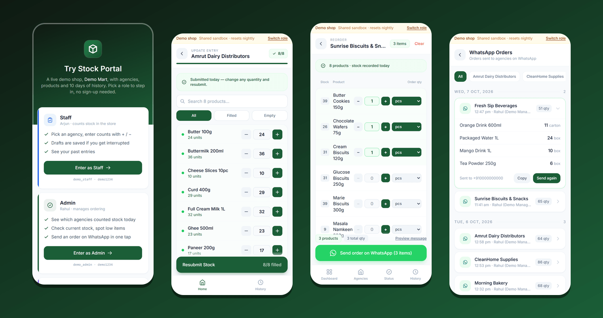
</p>

---

## Contents

- [Try it](#try-it) · [Screenshots](#screenshots) · [Features](#features) · [How it works](#how-it-works)
- [Run it locally](#run-it-locally) · [Tests](#tests) · [Security](#security) · [Project structure](#project-structure) · [Roadmap](#roadmap)

## Try it

**[stock-portal-kappa.vercel.app/demo](https://stock-portal-kappa.vercel.app/demo)**: pick a role and you're in. No sign-up.

You'll be working in **Demo Mart**, a sample shop with 7 supplier agencies, 54 products and
10 days of stock history.

| Role | Username | Password | Good for trying |
| --- | --- | --- | --- |
| Staff | `demo_staff` | `demo1234` | Counting stock agency by agency |
| Admin | `demo_admin` | `demo1234` | Today's status, current stock, WhatsApp ordering |
| Super Admin | `demo_super` | `demo1234` | Agencies, products, users, order history |

👉 **New here? Follow the [5-minute guided test](docs/TESTING.md).** It walks through each role step
by step, with what you should see at each step.

> The demo is shared by everyone and **resets every night**. User management is read-only, adding
> data is capped, and WhatsApp orders go to a dummy number. It works best on a phone, and you can
> install it from the browser menu (**Add to Home screen**) to use it like an app.

## Screenshots

| Sign in | Staff: pick an agency | Staff: count stock |
| :---: | :---: | :---: |
| 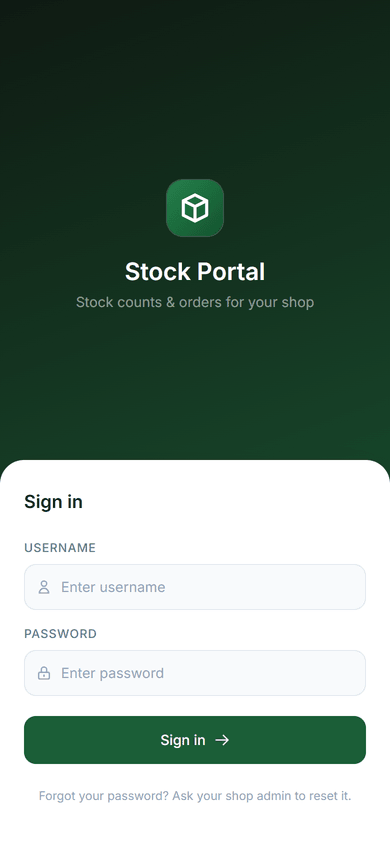 | 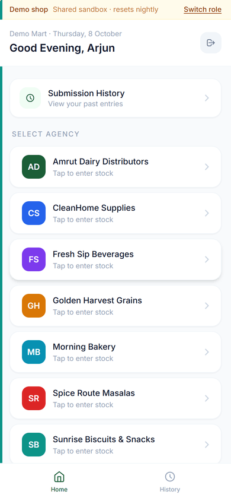 | 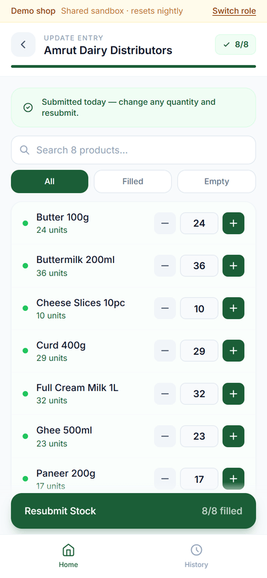 |
| **Admin: today at a glance** | **Admin: who has submitted** | **Admin: build a WhatsApp order** |
| 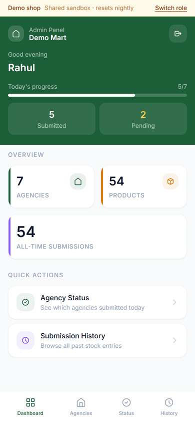 | 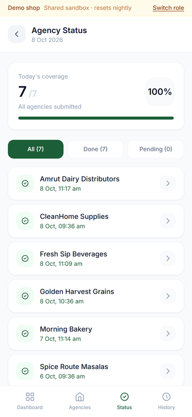 | 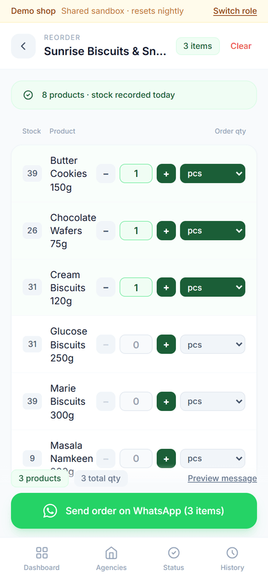 |
| **Super Admin: overview** | **Super Admin: WhatsApp order history** | **Super Admin: products** |
| 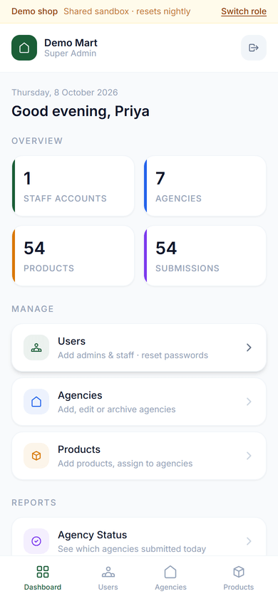 | 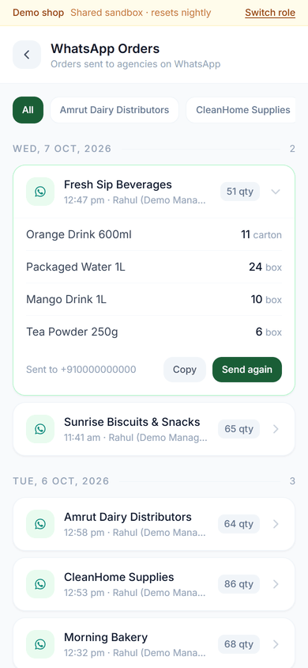 | 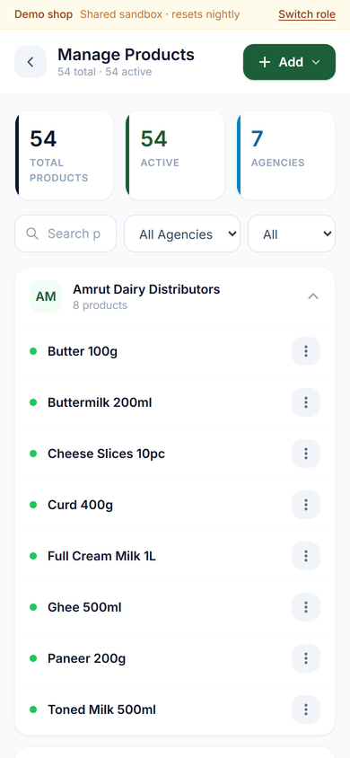 |

## Features

**Staff: counting stock on the shop floor**
- Pick a supplier agency and count each product with large + / − buttons. Search and
  filled/empty filters make long lists quick.
- Counts are saved as a draft on the phone, so an interruption doesn't lose work.
- Already counted today? The screen reopens with today's numbers to correct and resubmit.

**Admin: knowing what to reorder**
- Live progress: how many agencies have counted stock today, and which are still pending.
- Per agency: the latest stock with low items highlighted, plus an order builder (quantity + unit).
- **Send on WhatsApp** opens a neatly formatted order to the agency's WhatsApp number, and the
  order is saved to history automatically.

**Super Admin: running the shop**
- Manage staff and admin accounts (create, edit role, reset password, deactivate).
- Manage agencies (with WhatsApp numbers) and products, including **bulk add** by pasting a list.
- **WhatsApp order history**: every order sent, filterable by agency, with items, quantities,
  who sent it, and one-tap copy or resend.

**Platform owner: running the business** (`/platform/login`)
- Onboard a new shop and its first super admin in one step; edit or suspend shops.
- See each shop's users, agencies, products and last activity; reset any user's password.
- A completely separate login: shop users can't reach it, and the owner isn't a shop user.

**Everywhere**
- Mobile-first and installable (PWA). On laptops the layouts widen.
- Each shop sees only its own data and its own name; "today" follows each shop's time zone.

## How it works

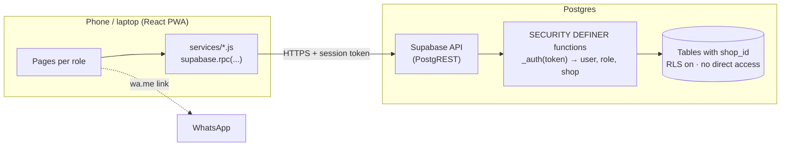

- **The browser never queries tables.** Every action is a SQL function that first resolves the
  session token to a user, role and shop, then reads or writes only that shop's rows. All tables
  have row-level security enabled with no policies, and table privileges are revoked from the
  public API roles.
- **Multi-tenant by design.** Every row carries a `shop_id`, and composite foreign keys make it
  impossible to attach a product, submission or order to another shop's agency or user.
- **Own auth, kept simple.** Usernames are unique across the platform; passwords are bcrypt
  (cost 10); sessions are random tokens with expiry (30 days for shops, 12 hours for the owner).
- **Schema changes are plain SQL files** in [`db/`](db/README.md): numbered migrations, each in one
  transaction, each with a tested rollback.

| Layer | Tech |
| --- | --- |
| Frontend | React 19, React Router 7, Vite 8, Tailwind CSS 3, `vite-plugin-pwa` |
| Backend | Supabase (Postgres 15+, PostgREST), `pgcrypto`, optional `pg_cron` for the demo reset |
| Hosting | Vercel (production from `main`, a preview for every branch) |
| Tests | PGlite (Postgres compiled to WebAssembly) running the real migrations |

## Run it locally

You need Node 20+ and a Supabase project (the free tier is fine).

```bash
git clone https://github.com/krishna-1688/Stock-portal.git
cd Stock-portal
npm ci
cp .env.example .env    # set VITE_SUPABASE_URL and VITE_SUPABASE_ANON_KEY
npm run dev             # http://localhost:5173
```

Set up the database by running these in the Supabase **SQL Editor**, in order:

1. `db/reference_production_schema.sql` (base tables and functions, for a new project)
2. `db/001_multi_tenant.sql` (shops, isolation, owner console)
3. `db/003_whatsapp_orders_and_hardening.sql` (order history, login lockout)
4. `db/005_demo_shop_and_ip_rate_limit.sql` (optional demo shop, IP rate limit)
5. `db/002_create_platform_owner.sql` (edit it first: creates your owner login)

Details, rollbacks and the production runbook are in [`db/README.md`](db/README.md).

## Tests

```bash
npm run test:db
```

No Supabase account needed. The suite builds a local Postgres replica of the production schema,
applies every migration, and runs **190+ checks**, including:

- existing data is byte-identical after each migration, and the old app keeps working;
- **cross-shop attacks**: a second shop trying to read, edit or delete the first shop's data
  through every function (all blocked);
- login lockout, per-IP rate limiting, password-hash upgrades, demo guards and caps;
- every rollback script restores the exact previous state;
- every `supabase.rpc(...)` call in the frontend matches a real function signature.

CI runs lint, these tests and a production build on every push and pull request.

## Security

Highlights: shop isolation enforced in the database, no direct table access from the browser,
bcrypt cost 10, **per-username and per-IP login rate limiting**, size limits on every input, and
security headers with a Content-Security-Policy.

- Full audit with every finding and its status: [`docs/SECURITY_AUDIT.md`](docs/SECURITY_AUDIT.md)
- Found a vulnerability? Please report it privately: [`SECURITY.md`](SECURITY.md)

## Project structure

```
src/
  pages/
    staff/ admin/ superadmin/   screens for each shop role
    platform/                   owner console (separate login)
    Login.jsx  Demo.jsx         sign in · public demo picker
  services/                     one file per area; every call is supabase.rpc(...)
  context/authContext.jsx       session, current user and shop
  utils/                        session storage, per-user drafts
db/
  00x_*.sql  rollback_*.sql     migrations (one transaction each) and their undo scripts
  tests/                        PGlite test suites (npm run test:db)
docs/
  TESTING.md                    guided test for demo users
  SECURITY_AUDIT.md             security review
  screenshots/
```

## Roadmap

- Audit log of admin actions, visible to the shop's super admin
- Two-factor sign-in for the platform owner
- Hashed session tokens at rest
- Low-stock alerts and suggested order quantities
- Export submissions and orders to Excel

## License

© 2026 Krishna Kumar. All rights reserved. The source is public so you can see how it's built and
try the demo; it isn't licensed for reuse or redistribution. Interested in using Stock Portal for
your shop? [Open an issue](https://github.com/krishna-1688/Stock-portal/issues/new/choose) and I'll get in touch.
