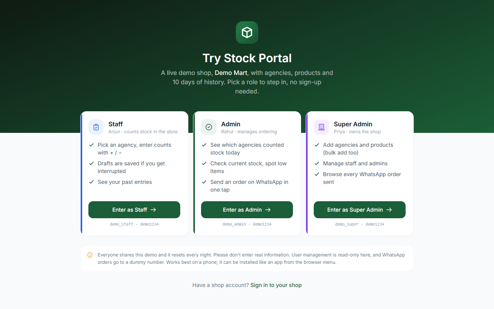

# Guided test: Stock Portal in 5 minutes

This walks you through the app the way a real shop uses it: **staff count the stock → the admin
sees it and orders on WhatsApp → the owner reviews everything.** Each step says what you should see.
If something doesn't match, please [report it](#found-something).

**Before you start**
- Open **[stock-portal-kappa.vercel.app/demo](https://stock-portal-kappa.vercel.app/demo)**, ideally on a **phone**
  (on a laptop, narrow the window or use the browser's device toolbar).
- Everything happens in **Demo Mart**, a shared sample shop that resets every night. Please don't
  enter real personal information.
- To switch role at any time, tap **Switch role** in the yellow strip at the top, or log out:
  you'll land back on the demo page.

---

## 1. Staff: count stock (about 2 min)

Tap **Enter as Staff** (or sign in with `demo_staff` / `demo1234`).

| Do this | You should see |
| --- | --- |
| Look at the home screen | "Good morning/afternoon/evening, Arjun", **Demo Mart** and today's date at the top, and a list of 7 agencies |
| Tap **Morning Bakery** or **Spice Route Masalas** | An empty count sheet: these two haven't been counted today |
| Tap **+** a few times on 3–4 products, or type a number | The counter at the top shows how many products are filled |
| Use **Search** and the **Filled / Empty** tabs | The list narrows instantly |
| Go **back**, then open the same agency again | Your numbers are still there ("draft restored"): drafts survive interruptions |
| Open it again and tap **Submit Stock** → confirm | "Stock submitted", then you're back on the agency list |
| Open **Amrut Dairy Distributors** | It opens as **Update Entry** with today's numbers filled in: change one and **Resubmit** |
| Tap **History** at the bottom | Your submissions, newest first; tap one to see its items |

## 2. Admin: see today's status and order on WhatsApp (about 2 min)

Tap **Switch role** → **Enter as Admin** (`demo_admin` / `demo1234`).

| Do this | You should see |
| --- | --- |
| Look at the dashboard | **Today's progress** (e.g. 6/7 submitted, including yours), plus agency, product and submission totals |
| Tap **Status** | Every agency with when it was last counted and by whom |
| Tap **Agencies** → **Sunrise Biscuits & Snacks** | Current stock next to each product (low counts highlighted) and an order column |
| Add order quantities to 2–3 products and change a unit (pcs / box / carton…) | The bottom bar shows "Send order on WhatsApp (3 items)" |
| Tap **Preview message** | The exact WhatsApp text: shop name, date, agency, and one line per item |
| Tap **Send order on WhatsApp** | WhatsApp (or WhatsApp Web) opens with the message pre-filled. In the demo the number is a dummy, so WhatsApp will say it's invalid. That's expected, and nothing is sent to anyone. |

## 3. Super Admin: review and manage (about 1 min)

Tap **Switch role** → **Enter as Super Admin** (`demo_super` / `demo1234`).

| Do this | You should see |
| --- | --- |
| Dashboard → **WhatsApp Orders** | The order you just sent at the top, plus earlier sample orders; tap one for items, **Copy** and **Send again** |
| Filter by an agency (chips at the top) | Only that agency's orders |
| **Products** → **Add** → **Bulk Add**, choose an agency, paste a few lines like `Green Tea 100g` | One chip per product, duplicates flagged; **Create** adds them all |
| **Agencies** → add an agency with any name | It appears in the list (and for staff) straight away |
| **Users** → try to add or edit a user | A message that user management is **turned off in the demo**. In a real shop this is where staff accounts are created and passwords reset |

## 4. Things worth trying

- **Install it:** browser menu → **Add to Home screen**. It opens full-screen like a native app.
- **Wrong password:** on [/login](https://stock-portal-kappa.vercel.app/login), enter a wrong password a few
  times. The button makes you wait, and the server limits repeated failures (demo accounts are exempt
  from lockout, but rate limiting by network still applies).
- **Privacy between shops:** the demo is one of several shops on the same system; you'll never see
  another shop's agencies, products or people.

## What the demo doesn't show

- **Platform owner console** (`/platform`): where shops are created and suspended. It has its
  own private login. See the [README](../README.md#features) for what it does.
- **User management:** read-only in the demo so nobody can lock the shared accounts.

## Found something?

[Open an issue](https://github.com/krishna-1688/Stock-portal/issues/new/choose) and include:

1. which role you were using and the page (the address bar);
2. what you did, what you expected, and what happened;
3. your device and browser (e.g. "Android, Chrome"); a screenshot helps a lot.

For anything security-related, please follow [SECURITY.md](../SECURITY.md) instead of opening a public issue.
